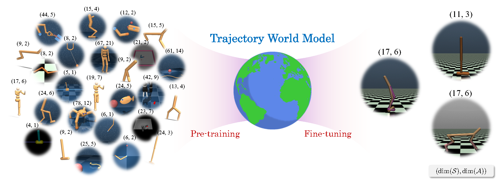

# Trajectory World Models for Heterogeneous Environments

[](https://arxiv.org/abs/2502.01366)

This is the official code base for the paper [Trajectory World Models for Heterogeneous Environments](https://arxiv.org/abs/2502.01366).



Give it a star 🌟 if you find our work useful!

## 🔥 News

- 🚩 **2025.06.05**: Training code is released.
- 🚩 **2025.05.01**: TrajWorld has been accepted by ICML 2025, congrats!.
- 🚩 **2025.02.03**: Our paper is released on [arXiv](https://arxiv.org/abs/2502.01366).

## 🛠️ Installation

```bash
conda env create -f environment.yaml
conda activate trajworld
```

## 🌟 Pre-training

To pre-train the TrajWorld model:

```bash
python scripts/pretrain/pretrain_trajworld.py history_length=20 log_root_dir=log_pretrain_trajworld exp_name=merge_all n_blocks=6
```

See more baseline scripts in [`scripts/pretrain`](scripts/pretrain).

## 🎇 Fine-tuning

To fine-tune TrajWorld:

```bash
python scripts/training/train_trajworld.py env_name=hopper-medium-replay-v2 log_root_dir=log_model_new trm_epoch_steps=5000 dynamics_max_epochs_since_update=300 dynamics_max_epochs=50 seed=183 train_model_only=true exp_name=trajworld_ft trm_lr=1e-5 load_pt_dynamics_path="pt_model/trajworld_pt/trajworld_pt.pkl" n_blocks=6
```

To train from scratch, simply remove the load_pt_dynamics_path argument.

More fine-tuning scripts for baseline models can be found in [`scripts/training`](scripts/training).

## 📊 Evaluation

### 🔁 Transition Prediction Evaluation

```bash
python pred/pred_mse_trajworld.py --env walker2d-random-v2 --model_path <path_to_your_model> --n_blocks 6
```

Additional baseline scripts:  [`pred`](pred).

### 📈 OPE Evaluation

```bash
python ope/ope_eval.py --algo trajworld --env halfcheetah-expert-v2 --clear_kv_cache_every 10 --trm_lookback_window 10 --group 0 --n_blocks 6
```

Specify your model path by modifying `get_list_dirs()` in [`ope/ope_eval.py`](ope/ope_eval.py).

Example commands for other baselines are provided at the top of the file.

### 🤖 MPC Evaluation

```bash
python mpc/mpc.py --algo trajworld --env walker2d-medium-replay-v2 --group 5 --clear_kv_cache_every 10 --trm_lookback_window 10 --action_proposal_id 3 --std 0.1
```

As above, modify `get_list_dirs()` in  [`ope/ope_eval.py`](ope/ope_eval.py) to set your model path.

Baseline examples are included in the script.


## 🚀 Release Progress

- [ ] UniTraj Dataset
- [x] Pre-trained TrajWorld Model
- [x] Transition prediction evaluation
- [x] OPE evaluation
- [x] MPC evaluation
- [x] Training code for Trajworld, TDM and MLP-Ensemble

## 📜 Citation

If you find this project useful, please cite our paper as:

```
@article{yin2025trajectory,
  title={Trajectory World Models for Heterogeneous Environments},
  author={Yin, Shaofeng and Wu, Jialong and Huang, Siqiao and Su, Xingjian and He, Xu and Hao, Jianye and Long, Mingsheng},
  journal={arXiv preprint arXiv:2502.01366},
  year={2025}
}
```

## 🤝 Contact

If you have any questions, please contact yinshaofeng04@gmail.com.

## 💡 Acknowledgement

We sincerely appreciate the following github repos for their valuable codebase we build upon:

- https://github.com/nissymori/JAX-CORL
